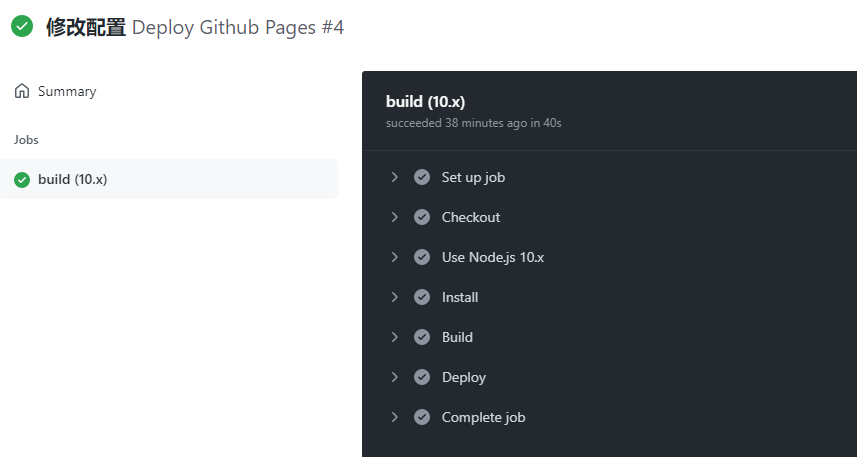
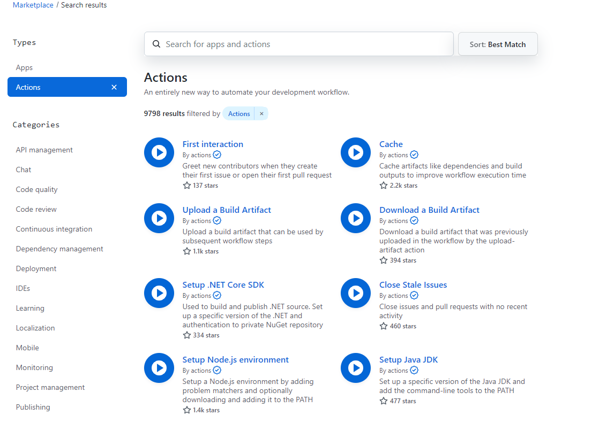

# Github Actions功能实现Vuepress项目push后自动部署到Github Page

> 插件市场：https://github.com/marketplace?type=actions
>
> `peaceiris/actions-gh-pages@v3` 插件配置见 https://github.com/peaceiris/actions-gh-pages

## 使用Github Actions

点击要使用仓库`x-blog`的Actions，选择设置一种workflow模板。

选择Node.js的模板
选择后配置相关动作和流程，然后提交就可以了。提交后会在仓库中生成`./github/workflows/xxx.yml`文件以后每次执行配置的动作就可以自动执行配置的流程

### 推荐配置

```shell
name: github pages

on:
  push:
    branches:
    - master

jobs:
  build-deploy:
    runs-on: ubuntu-latest
    steps:
    - uses: actions/checkout@v1
    - run: npm ci # 相当于npm install
    - run: npm run docs:build

    - name: Deploy
      uses: peaceiris/actions-gh-pages@v3
      with:
      	personal_token: ${{ secrets.ACCESS_TOKEN }}
      	external_repository: xu-ux/x-blog
      	publish_branch: pages
      	publish_dir: docs/.vuepress/dist

```

### 解析

`peaceiris/actions-gh-pages@v3` 插件配置见 https://github.com/peaceiris/actions-gh-pages

1. 当push文件到仓库上的master分支时触发流程。
2. 使用`actions/checkout@v1`插件拉取代码。并下载依赖包npm install和打包项目npm run build。
3. 使用`peaceiris/actions-gh-pages@v3`插件发布到相关仓库中

### 个人配置

```shell
name: Deploy Github Pages

# 在master分支发生push事件时触发。
on:
  push:
    branches:
      - master
      
jobs: # 工作流
  build:
    runs-on: ubuntu-latest #运行在虚拟机环境ubuntu-latest

    strategy:
      matrix:
        node-version: [10.x]

    steps:
      - name: Checkout
        uses: actions/checkout@v1 # 使用的动作。格式：userName/repoName。作用：检出仓库，获取源码。 官方actions库：https://github.com/actions
        
      - name: Use Node.js ${{ matrix.node-version }}
        uses: actions/setup-node@v1 # 作用：安装nodejs
        with:
          node-version: ${{ matrix.node-version }}

      - name: Install
        run: npm install

      - name: Build
        run:  npm run docs:build

      - name: Deploy
        uses: peaceiris/actions-gh-pages@v3
        with:
          personal_token: ${{ secrets.ACCESS_TOKEN }}
          external_repository: xu-ux/x-blog
          publish_branch: pages
          publish_dir: docs/.vuepress/dist

```

执行过程：




插件市场：https://github.com/marketplace?type=actions

