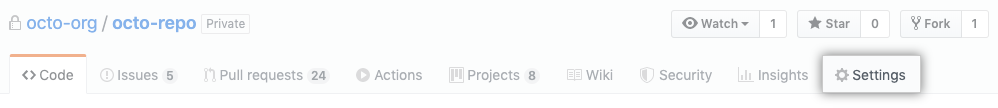

# 通过GitHub Action发布vuepress到github Page

# GitHub Action 的概念

Github action 可以帮助我们完成持续集成（CI）和持续部署（CD）。你可以自定义工作流程，而且你还可以引用[github action](https://links.jianshu.com/go?to=https%3A%2F%2Fgithub.com%2Fmarketplace%3Ftype%3Dactions) 市场里面其他人提交的action。可以先熟悉下以下概念：

- Workflow: 工作流可以让你在GitHub 上完成构建，测试，打包，发布或部署任意项目。工作流由一个或者多个job组成。workflow file 文件放在.github/workflows这个目录下面。
- job: 工作流由一个或者多个job组成，还可以在工作流中定义job的依赖顺序。
- Step: 是一个单独的步骤，可以是执行某一个run 命令，或者一个action。一个job里面可以包含多个step。
- action: 是工作流中最小的可移植模块，action 可以在社区共享。action需要step里面去执行。

# workflow file 文件介绍

workflow file 文件放在.github/workflows这个目录下面。workflow 文件以[YAML格式](https://links.jianshu.com/go?to=http%3A%2F%2Fwww.ruanyifeng.com%2Fblog%2F2016%2F07%2Fyaml.html),

- name 是workflow的名称

- on: push 是触发条件，在推送的时候触发，还可以指定分支

  

  ```yaml
  on:
    push:
      branches:
        - master
  ```

- runs-on: 是依赖虚拟环境runner

## workflow 文件示例，发布vuepress 博客到github page.


```shell
name: Deploy GitHub Pages

# 触发条件：在 push 到 master 分支后
on:
  push:
    branches:
      - master

# 任务
jobs:
  build-and-deploy:
    runs-on: ubuntu-latest
    steps:
      - name: Checkout
        uses: actions/checkout@v2
        with:
          persist-credentials: false

      - name: install
        run: yarn install 

      - name: Build
        run:  yarn build

      - name: Deploy
        uses: JamesIves/github-pages-deploy-action@releases/v3
        with:
          ACCESS_TOKEN: ${{ secrets.ACCESS_TOKEN }}
          REPOSITORY_NAME: aaronTang98/aaronTang98.github.io
          BRANCH: master
          FOLDER: public
```

- 上面yml的含义是
- 第一步拉取代码
- 第二步 安装
- 第三步 编译
- 第四步 发送到github page的工程和目录

## secret 配置

这个示例需要将构建成果发到 GitHub 仓库，因此需要 GitHub 密钥。按照[官方文档](https://links.jianshu.com/go?to=https%3A%2F%2Fhelp.github.com%2Fen%2Farticles%2Fcreating-a-personal-access-token-for-the-command-line)，生成一个密钥。然后，将这个密钥储存到当前仓库的`Settings/Secrets`里面。

上面的配置中引入了变量`secrets.ACCESS_TOKEN`，这个可以在repository里面选择settings。




1. 在左边的菜单选择 **Secrets**.
2. 点击添加一个新的 **secret**.
3. 输入secret的**名字**，例如：ACCESS_TOKEN
4. 输入secret的**值**
5. 点击**Add secret**.

<Vssue title="发布vuepress到GithubPage" />